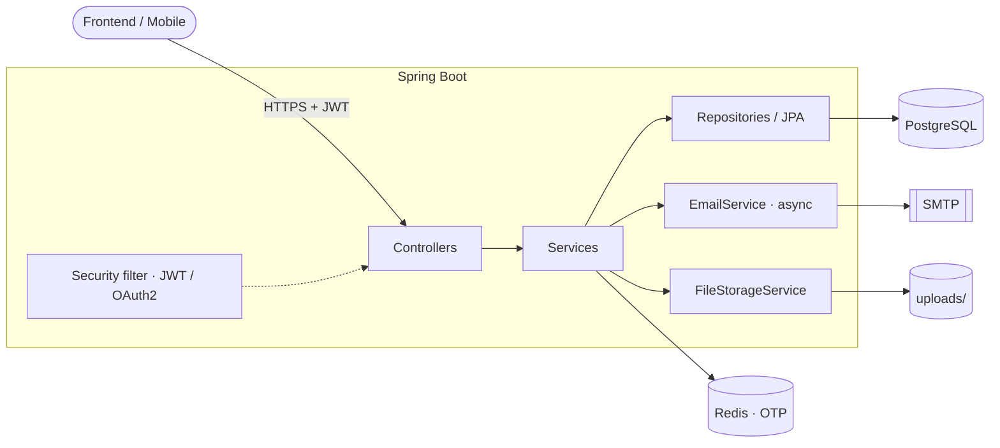
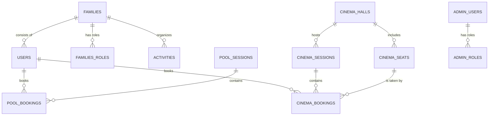

<div align="center">

# 🏘️ Hansen Village

**Backend for a residents' app: pool and cinema booking, community events, and family accounts.**

Java 25 · Spring Boot 3.4.5 · PostgreSQL 16 · Redis 7 · Liquibase · Docker

</div>

---

## 📖 About

**Hansen Village** is a REST API for a closed residential community. The unit of account is the **family**: it registers with an invite code, gets a shared account, and then books pool sessions and cinema seats for its members and keeps up with events in the village.

### Features

| | Module | What it does |
|---|---|---|
| 🔐 | **Authentication** | Invite-code registration with email OTP confirmation, password login, Google OAuth2 login, JWT access/refresh tokens, password recovery, one-time-code login for admins |
| 👨‍👩‍👧 | **Families & residents** | Family profile, family members, profile picture, booking history |
| 🏊 | **Pool** | Weekly schedule built from templates, session booking, per-family ticket limit, cancellation with or without refund |
| 🎬 | **Cinema** | Halls and seat maps, weekly program, posters, specific seat selection, booking cancel and restore |
| 🎉 | **Activities** | Regular and one-off resident activities with images and contact details |
| 🏢 | **Facilities** | Catalog of village amenities (pool, cinema, leisure) with images |
| 🛠️ | **Administration** | Admin and role management, manual family registration, family lookup by address |

---

## 🧱 Tech Stack

- **Language / platform:** Java 25, Spring Boot 3.4.5
- **Web & security:** Spring Web, Spring Security, OAuth2 Client (Google), JWT (Nimbus JOSE + JWT), BCrypt
- **Data:** Spring Data JPA (Hibernate, `ddl-auto: validate`), PostgreSQL 16, **Liquibase** migrations
- **Cache & OTP:** Redis 7 (one-time codes, resend cooldown)
- **Mail:** Spring Mail (SMTP, Gmail by default), sent asynchronously
- **Utilities:** MapStruct, Lombok, libphonenumber (phone validation), Apache Tika (file type checks), Spring Retry, Actuator
- **Testing:** JUnit 5, Spring Boot Test, Testcontainers (PostgreSQL)
- **Deployment:** Docker / Docker Compose, shell scripts for deploy, backup, and restore

---

## 🏗️ Architecture

A classic layered structure with clear separation of concerns:



### Repository layout

```text
hansenville/
├── src/main/java/com/hansenvillage/hansenapp/
│   ├── controller/    # REST controllers (/api/**)
│   ├── service/       # business logic
│   ├── repository/    # Spring Data JPA
│   ├── entity/        # JPA entities and enums
│   ├── dto/           # API requests and responses
│   ├── mapper/        # MapStruct mappers
│   ├── security/      # JWT, filter, OAuth2 handlers
│   ├── config/        # Security, Async, Retry, Phone
│   ├── exception/     # AppException, AppErrorCode, global handler
│   └── constant/      # constants (Redis, OTP, uploads)
├── src/main/resources/
│   ├── application.yml
│   └── db/changelog/  # Liquibase migrations (001 … 012)
├── src/test/          # unit, E2E, and stress tests
├── docker/            # compose files for server and local dev, deploy/backup/restore
├── Dockerfile
└── pom.xml
```

---

## 🚀 Quick Start (Local)

### Prerequisites

- **JDK 25**
- **Docker** (for PostgreSQL, Redis, and running integration tests)
- A Google Cloud OAuth2 client and SMTP access (e.g., a Gmail app password)

### 1. Start PostgreSQL and Redis

```bash
docker compose -f docker/docker-local/docker-compose.yaml up -d
```

This starts `postgres:16-alpine` (database `hansen-village`, user `myUser`, password `myPass`, port `5432`) and `redis:7-alpine` (port `6379`).

### 2. Set environment variables

```bash
export SPRING_DATASOURCE_USERNAME=myUser
export SPRING_DATASOURCE_PASSWORD=myPass

export STORE_JWT_SECRET='replace-with-a-random-string-of-at-least-32-chars'

export GOOGLE_CLIENT_ID=...
export GOOGLE_CLIENT_SECRET=...

export MAIL_USERNAME=your_email@gmail.com
export MAIL_PASSWORD=your_app_password
```

The full list of settings is in the [Configuration](#️-configuration) section.

### 3. Run the application

```bash
./mvnw spring-boot:run
```

The API will be available at **http://localhost:8080**. On first start, Liquibase creates the schema and seed data automatically.

> 💡 CORS is allowed by default for `http://localhost:5173` and `http://127.0.0.1:5173` (the Vite dev server). For a different frontend, set `APP_CORS_ALLOWED_ORIGINS`.

---

## ⚙️ Configuration

All settings are provided via environment variables (see `application.yml`).

| Variable | Required | Default | Description |
|---|:---:|---|---|
| `SPRING_DATASOURCE_URL` | — | `jdbc:postgresql://localhost:5432/hansen-village` | JDBC connection string |
| `SPRING_DATASOURCE_USERNAME` | ✅ | — | Database user |
| `SPRING_DATASOURCE_PASSWORD` | ✅ | — | Database password |
| `SPRING_DATA_REDIS_HOST` | — | `localhost` | Redis host |
| `SPRING_DATA_REDIS_PORT` | — | `6379` | Redis port |
| `STORE_JWT_SECRET` | ✅ | — | JWT signing secret (≥ 32 characters) |
| `STORE_JWT_EXPIRATION_MS` | — | `86400000` (24 h) | Access token lifetime |
| `STORE_JWT_REFRESH_EXPIRATION_MS` | — | `2592000000` (30 days) | Refresh token lifetime |
| `GOOGLE_CLIENT_ID` | ✅ | — | Google OAuth2 client id |
| `GOOGLE_CLIENT_SECRET` | ✅ | — | Google OAuth2 client secret |
| `MAIL_HOST` | — | `smtp.gmail.com` | SMTP server |
| `MAIL_PORT` | — | `465` | SMTP port (SSL) |
| `MAIL_USERNAME` | ✅ | — | SMTP login |
| `MAIL_PASSWORD` | ✅ | — | SMTP password / app password |
| `APP_CORS_ALLOWED_ORIGINS` | — | `http://localhost:5173,http://127.0.0.1:5173` | Comma-separated allowed origins |

For Docker Compose deployment, the `.env` file additionally needs `POSTGRES_DB`, `POSTGRES_USER`, and `POSTGRES_PASSWORD` (see `secrets.env.example`).

> ⚠️ Never commit a `.env` file with real secrets. `*.env` files are already listed in `.gitignore`.

---

## 🔌 API

The base prefix is `/api`. All endpoints except `POST /api/auth/**` require the header:

```http
Authorization: Bearer <access_token>
```

<details>
<summary><b>🔐 Authentication — <code>/api/auth</code></b></summary>

| Method | Path | Description |
|---|---|---|
| `POST` | `/register/initiate` | Start registration: validate invite code, send OTP to email |
| `POST` | `/register/confirm` | Confirm registration with the emailed code, receive tokens |
| `POST` | `/login` | Log in with email and password |
| `POST` | `/refresh` | Refresh the token pair |
| `POST` | `/password/forgot` | Request a password reset code |
| `POST` | `/password/reset` | Set a new password using the code |
| `POST` | `/admins/login/initiate` | Admin login: request a code |
| `POST` | `/admins/login/confirm` | Admin login: confirm the code |
| `POST` | `/resend-code` | Resend an OTP (60 s cooldown) |

Google login is also available at `/oauth2/authorization/google`.

</details>

<details>
<summary><b>👨‍👩‍👧 Families — <code>/api/families</code></b></summary>

| Method | Path | Description |
|---|---|---|
| `GET` / `PUT` / `DELETE` | `/me` | My family: view, update, delete |
| `POST` | `/me/members` | Add a family member |
| `PUT` / `DELETE` | `/members/{id}` | Update / remove a family member |
| `GET` | `/me/tickets/pool` | Remaining pool tickets |
| `GET` | `/me/bookings/history` | Booking history |
| `GET` / `POST` / `PUT` / `DELETE` | `/me/pictures` | Profile picture |
| `GET` / `PUT` / `DELETE` | `/{id}` | Family by id (admin) |
| `GET` | `/{id}/pictures` | Family picture by id |

</details>

<details>
<summary><b>🏊 Pool — <code>/api/pool</code></b></summary>

| Method | Path | Description |
|---|---|---|
| `GET` | `/sessions/week` | Weekly schedule |
| `GET` | `/sessions/{id}` | Session details |
| `POST` | `/sessions` | Publish a weekly schedule |
| `PUT` / `DELETE` | `/sessions/{id}` | Update / delete a session |
| `POST` | `/sessions/{id}/cancel` · `/uncancel` | Cancel / restore a session |
| `POST` | `/sessions/cancel-by-day` · `/uncancel-by-day` | Cancel / restore all sessions of a day (`?date=YYYY-MM-DD`) |
| `GET` / `POST` | `/templates` | Weekly templates |
| `POST` | `/templates/generate` | Generate a schedule from templates |
| `POST` | `/bookings` | Book a session |
| `GET` | `/bookings/{id}` | Booking by id |
| `DELETE` | `/bookings/{id}` | Cancel a booking |
| `GET` | `/bookings/me/active` | My family's active bookings |
| `GET` | `/bookings/sessions/{sessionId}` | Bookings for a session |
| `GET` | `/bookings/families/{familyId}` · `/users/{userId}` | Bookings by family / resident |
| `DELETE` | `/bookings/sessions/{sessionId}` | Cancel all of the family's bookings for a session |

</details>

<details>
<summary><b>🎬 Cinema — <code>/api/cinema</code></b></summary>

| Method | Path | Description |
|---|---|---|
| `POST` | `/halls` | Create a hall |
| `GET` | `/halls/{hallId}/seats` | Hall with seat map |
| `PUT` / `DELETE` | `/halls/{hallId}` | Update / delete a hall |
| `GET` | `/sessions/week` | Weekly program |
| `GET` | `/sessions/{id}` | Session with seat availability |
| `POST` | `/sessions` | Publish a weekly program |
| `PUT` / `DELETE` | `/sessions/{id}` | Update / delete a session |
| `POST` | `/sessions/{id}/cancel` · `/uncancel` | Cancel / restore a session |
| `GET` / `POST` / `PUT` / `DELETE` | `/sessions/{id}/poster` | Movie poster |
| `POST` | `/bookings` | Book seats |
| `GET` | `/bookings/{id}` | Booking by id |
| `DELETE` | `/bookings/{id}` | Delete a booking |
| `POST` | `/bookings/{id}/cancel` · `/uncancel` | Cancel / restore a booking |
| `GET` | `/bookings/users/{userId}` · `/sessions/{sessionId}` | Bookings by resident / session |
| `GET` | `/bookings/history/families/{id}` | A family's booking history |

</details>

<details>
<summary><b>🎉 Activities & Facilities — <code>/api/activities</code>, <code>/api/facilities</code></b></summary>

| Method | Path | Description |
|---|---|---|
| `GET` | `/api/activities?type=REGULAR\|SINGLE` | List activities |
| `GET` | `/api/activities/me` | My activities |
| `POST` | `/api/activities` | Create an activity |
| `GET` / `PUT` / `DELETE` | `/api/activities/{id}` | View, update, delete |
| `POST` / `GET` / `PUT` / `DELETE` | `/api/activities/{id}/images` | Activity image |
| `GET` | `/api/facilities` | Village facilities catalog |
| `POST` / `GET` / `PUT` / `DELETE` | `/api/facilities/{id}/images` | Facility image |

</details>

<details>
<summary><b>🛠️ Administration — <code>/api/admins</code></b></summary>

| Method | Path | Description |
|---|---|---|
| `GET` / `POST` | `/` | List admins (grouped by role) / create an admin |
| `PUT` / `DELETE` | `/{id}` | Update / delete an admin |
| `GET` | `/families?address=` | Find a family by address |
| `POST` | `/families` | Register a family manually |
| `DELETE` | `/families?address=` | Delete a family by address |
| `POST` / `DELETE` | `/families/{familyId}/roles/activity` | Grant / revoke the `ACTIVITY` role |
| `POST` | `/families/{id}/members` | Add a resident to a family |

</details>

### Error format

Errors are returned consistently via `GlobalExceptionHandler`, based on `AppErrorCode` (e.g., `POOL_SESSION_IS_FULL`, `SEAT_ALREADY_BOOKED`, `OUT_OF_TICKETS`, `INVALID_VERIFICATION_CODE`).

---

## 🧠 Business Rules

**Registration & access**
- Registration requires an **invite code**; once used, the code is marked `USED`.
- OTPs are 6 digits, stored in Redis for **10 minutes**, with a **60-second** resend cooldown.
- Tokens: access (24 h by default) and refresh (30 days by default).
- Roles: `USER`, `ACTIVITY`, `POOL_MANAGER`, `CINEMA_MANAGER`, `SUPER_ADMIN`.

**Pool**
- Default session capacity is **40 people**.
- Ticket limit: **2 per family member per week** (Monday through Sunday).
- A session that has already started cannot be booked.
- Cancelling **6 or more hours** before the start gives `CANCELED_WITH_RETURN` (the ticket is returned); later cancellations give `CANCELED_WITHOUT_RETURN`.

**Cinema**
- The default hall has **36 seats** (rows A–D, seats 1–9).
- A single booking cannot take **more seats than the family has members**.
- The same seat cannot be actively booked twice for a session, enforced by a partial unique index in the database.
- Bookings can be cancelled and restored until the session starts.

**Concurrency**
- Pool and cinema sessions use **optimistic locking** (`@Version`), and the booking services use **`@Retryable`** on version conflicts. This prevents overbooking under concurrent requests (covered by the stress tests).

**Files**
- Images: `jpeg`, `png`, `webp`, up to **10 MB**; the type is verified with Apache Tika.
- Stored under `uploads/` (`facilities`, `activities`, `posters`, `families`).

---

## 🗄️ Database

The schema is managed by **Liquibase** (`db/changelog/changeset/001…012`); Hibernate runs in `validate` mode and never modifies the schema.



Standalone tables: `pool_templates` (weekly templates), `facilities` (facility catalog), `invite_codes` (invitations).

---

## 🧪 Testing

```bash
./mvnw test
```

The project includes:

- **Service unit tests** — auth, families, users, pool (sessions, templates, bookings), cinema (sessions, bookings);
- **E2E tests** (`BookingFlowE2ETest`, `CinemaFlowE2ETest`) — end-to-end HTTP scenarios against a real PostgreSQL;
- **Stress tests** (`PoolBookingStressTest`, `CinemaBookingStressTest`) — concurrent booking;
- **`DockerSmokeTest`** — environment check.

Integration tests use **Testcontainers** (`postgres:16-alpine`), so Docker must be running.

---

## 🐳 Deployment

The app is built into an image based on `eclipse-temurin:25-jre` and deployed to a VPS together with PostgreSQL and Redis via `docker/docker-compose.yaml`. Data lives in named volumes: `postgres_hansen_data`, `redis_hansen_data`, `uploads_hansen_data`.

### Build and ship the image (on your machine)

```bash
./mvnw -DskipTests package
docker build -t hansen-app:latest .
docker save hansen-app:latest -o hansen-app.tar
scp hansen-app.tar user@vps:/opt/hansen/
```

### Run on the server

Put `docker-compose.yaml`, `deploy.sh`, `backup.sh`, `restore.sh`, and a filled-in `.env` into `/opt/hansen`, then:

```bash
cd /opt/hansen
./deploy.sh            # loads the image from hansen-app.tar and recreates the app container
```

### Backup and restore

```bash
./backup.sh                                  # DB dump + uploads archive → backups/<date_time>/
./restore.sh backups/2026-07-28_12-00-00     # ⚠️ overwrites the current DB and uploads
```

A backup produces `db.sql.gz`, `uploads.tar.gz`, and `meta.txt`; older copies are removed after `BACKUP_KEEP_DAYS` days (default **14**). For regular backups, add `backup.sh` to `cron`.

---

## 🗺️ Roadmap

- [ ] API documentation (OpenAPI / Swagger)
- [ ] CI: build and run tests on every pull request

---
